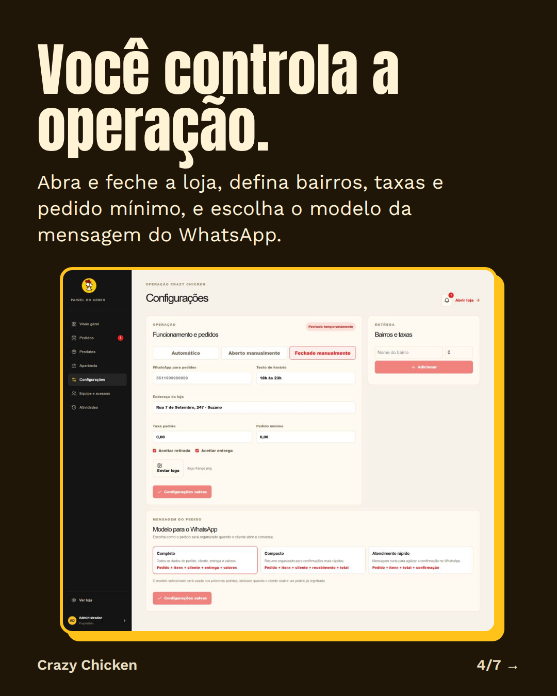
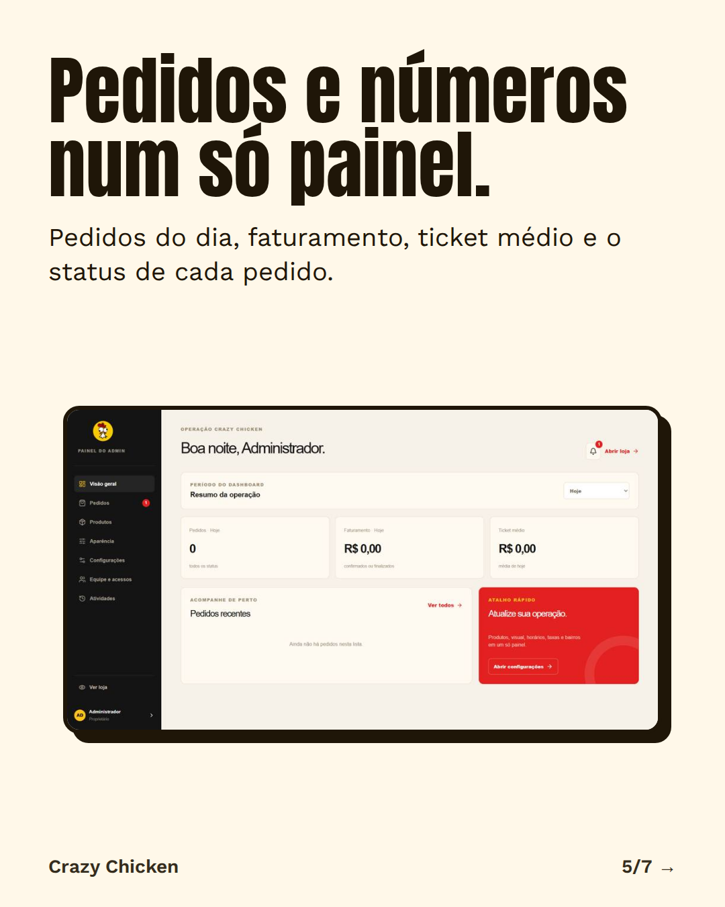

# Crazy Chicken — cardápio digital e operação

<p align="center">
  <strong>Uma vitrine digital para vender pelo WhatsApp e um painel para operar a loja em um só lugar.</strong>
</p>

<p align="center">
  <a href="https://crazychicken247.com.br">Ver aplicação</a> ·
  <a href="https://crazychicken247.com.br/admin/login">Acessar painel</a> ·
  <a href="SECURITY.md">Reportar vulnerabilidade</a>
</p>

## Sobre o projeto

O Crazy Chicken é uma aplicação web completa para restaurantes que precisam publicar um cardápio, receber pedidos e acompanhar a operação sem depender de uma plataforma de marketplace.

O cliente monta o pedido na loja, escolhe retirada ou entrega e confirma os dados pelo WhatsApp. A equipe administra catálogo, aparência, horários, bairros, taxas, pedidos e acessos individuais em um painel protegido.

> Marca: **Crazy Chicken**<br>
> Domínio atual: **[crazychicken247.com.br](https://crazychicken247.com.br)**<br>
> Banco de dados: **MariaDB/MySQL na Hostinger**

## O que a aplicação oferece

### Para clientes

- Cardápio responsivo para celular e desktop.
- Categorias, busca, destaques e produtos mais pedidos.
- Personalizações de sabores e extras.
- Carrinho persistente e cálculo de subtotal, entrega e total.
- Retirada no balcão ou entrega por bairros e taxas.
- Validação do pedido no servidor.
- Acompanhamento do pedido por código.
- Confirmação organizada pelo WhatsApp, com modelos completo, compacto e rápido.
- Loja aberta, fechada ou automática conforme a agenda.

### Para a equipe

- Dashboard com pedidos, faturamento, ticket médio e períodos de análise.
- Atualização dos pedidos e sinalização de novas pendências.
- Detalhes completos do pedido e alteração de status.
- Cadastro, edição, disponibilidade e destaque de produtos.
- Editor de opções, sabores e extras.
- Aparência da loja com prévia e cores personalizadas.
- Horários semanais, virada de dia, abertura manual e fechamento manual.
- Bairros, taxas de entrega e pedido mínimo.
- Convites e acessos individuais por função.
- Suspensão e reativação de membros da equipe.
- Histórico de atividades administrativas.
- Logout, recuperação segura do proprietário e MFA opcional.

## Visão rápida

<p align="center">
  
</p>

<details>
  <summary><strong>Ver apresentação visual completa</strong></summary>

  <p align="center">
    
    
  </p>
  <p align="center">
    
    
  </p>
  <p align="center">
    
    
  </p>
</details>

## Arquitetura

```text
Cliente
  └─ Loja pública Next.js
       ├─ catálogo, carrinho e checkout
       ├─ disponibilidade da loja
       └─ registro do pedido + WhatsApp

Equipe
  └─ Painel administrativo Next.js
       ├─ dashboard e pedidos
       ├─ produtos e aparência
       ├─ configurações operacionais
       └─ equipe, sessões e auditoria

Servidor
  ├─ Route Handlers /api/*
  ├─ autorização, CSRF e validações
  ├─ Drizzle ORM + mysql2
  ├─ MariaDB/MySQL da Hostinger
  └─ Resend para convites e recuperação por e-mail
```

O phpMyAdmin é usado somente para manutenção: backup, diagnóstico e importação de migrações. A aplicação acessa o banco diretamente pela `DATABASE_URL`; o painel não depende de PHP para funcionar.

## Stack

- **Next.js 16** com App Router e React 19.
- **TypeScript**.
- **Drizzle ORM** e **mysql2**.
- **MariaDB/MySQL** hospedado na Hostinger.
- **Tailwind CSS 4** e componentes React reutilizáveis.
- **Resend** para e-mails transacionais.
- **WhatsApp via `wa.me`** para confirmação de pedidos.
- **Node.js 22.13+**.

## Rodando localmente

### Pré-requisitos

- Node.js `>= 22.13.0`.
- npm.
- Uma instância MariaDB/MySQL para os fluxos que dependem de banco.

### Instalação

```bash
git clone https://github.com/andrewklayverr/crazychicken-cardapio.git
cd crazychicken-cardapio
npm ci
```

Crie um arquivo `.env.local` a partir de `.env.example` e preencha somente valores locais ou de desenvolvimento:

```bash
cp .env.example .env.local
```

No Windows PowerShell:

```powershell
Copy-Item .env.example .env.local
```

Inicie o ambiente de desenvolvimento:

```bash
npm run dev
```

Abra `http://localhost:3000`.

## Configuração de ambiente

As principais variáveis são:

| Variável | Finalidade |
| --- | --- |
| `DATABASE_URL` | Conexão com MariaDB/MySQL. |
| `DB_SSL` | Habilita SSL da conexão quando configurado. |
| `DB_CONNECTION_LIMIT` | Limite do pool de conexões. |
| `UPLOAD_DIR` | Diretório persistente para imagens enviadas pelo painel. |
| `AUTH_SECRET` | Segredo das proteções de autenticação. |
| `MFA_ENCRYPTION_KEY` | Chave de proteção dos dados de MFA. |
| `APP_URL` | Origem oficial usada em CSRF, links e redirecionamentos. |
| `RESEND_API_KEY` | Chave do Resend, somente no servidor. |
| `EMAIL_FROM` | Remetente dos e-mails transacionais. |

Variáveis de setup, recuperação e compatibilidade legada são temporárias. Gere-as somente quando necessário e remova-as depois de concluir o fluxo. Nunca publique `.env`, `hostinger.env`, senhas, hashes, backups ou chaves no GitHub.

## Banco e migrações

As migrações da aplicação ficam em [`db/migrations`](db/migrations):

1. `001_hostinger.sql` — estrutura inicial para a instalação na Hostinger.
2. `002_admin_accounts.sql` — contas, sessões, convites e auditoria administrativa.
3. `003_order_customization.sql` — opções e personalizações de produtos.
4. `004_admin_operations.sql` — funcionamento da loja, agenda e operações.
5. `005_whatsapp_templates.sql` — modelo de mensagem usado nos pedidos.

Antes de uma atualização importante:

```bash
npm run db:backup
npm run db:migrate
```

Em produção, faça backup pelo fluxo configurado para a Hostinger e confirme a migração no banco antes de publicar o novo código.

## Scripts úteis

| Comando | Uso |
| --- | --- |
| `npm run dev` | Desenvolvimento local. |
| `npm run build` | Build de produção com webpack. |
| `npm start` | Inicia a aplicação na porta fornecida pela Hostinger. |
| `npm run lint` | Verifica padrões e problemas de código. |
| `npm run test:store` | Testa regras de funcionamento da loja. |
| `npm run test:security` | Testa controles de segurança da aplicação. |
| `npm run test:whatsapp` | Testa a formatação dos pedidos para o WhatsApp. |
| `npm run db:generate` | Gera migrações Drizzle. |
| `npm run db:migrate` | Aplica migrações no MariaDB/MySQL. |
| `npm run db:backup` | Cria backup do banco configurado. |

## Publicação na Hostinger

Configure uma aplicação Node.js com:

```text
Build:  npm run build
Start:  npm start
Node:   22 ou superior
```

O diretório de uploads deve ser persistente e não pode depender da pasta temporária de um build. Para o domínio atual, configure:

```env
APP_URL=https://crazychicken247.com.br
```

O domínio usado no `APP_URL`, o remetente do Resend e os registros DNS precisam estar alinhados. Consulte [`HOSTINGER.md`](HOSTINGER.md) para o procedimento de migração, backup, domínio, e-mail e variáveis de produção.

## Segurança

Os controles relevantes ficam documentados em [`DESENVOLVIMENTO_SEGURO.md`](DESENVOLVIMENTO_SEGURO.md) e [`SECURITY.md`](SECURITY.md). Entre eles:

- autenticação individual por sessão administrativa;
- autorização no servidor por função e recurso;
- proteção CSRF e validação de origem;
- senhas com `scrypt` e tokens armazenados por hash;
- limites para login, recuperação, convites e pedidos;
- validação de tipo e assinatura em uploads;
- consultas parametrizadas pelo ORM;
- respostas públicas sem segredos de ambiente;
- auditoria das ações administrativas.

Uma auditoria de segurança não substitui a validação do ambiente produtivo. Antes de publicar alterações de autenticação ou infraestrutura, rode os testes, o lint, o build e valide os fluxos no staging ou no domínio de teste.

## Estrutura principal

```text
app/                 páginas públicas, admin e APIs
components/          interfaces compartilhadas e painel
db/                  schema e migrações SQL
lib/                  autenticação, catálogo, tema, horários e segurança
public/               imagens públicas da loja
scripts/              migração, backup, testes e inicialização
tests/                testes automatizados
docs/showcase/        imagens de apresentação do projeto
```

## Próximos passos

- Relatórios por período e exportação CSV.
- Produtos mais vendidos e horários de maior movimento.
- Promoções, cupons e combos.
- Controle de ingredientes e indisponibilidade automática.
- Histórico de clientes com consentimento.
- Fluxo de cozinha e impressão de pedidos.
- Despesas, margem e fechamento de caixa.
- Pix e pagamentos online.

## Licença

Projeto privado e proprietário. Consulte o responsável pelo repositório antes de reutilizar código, imagens, marca ou dados da operação.
